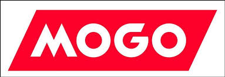
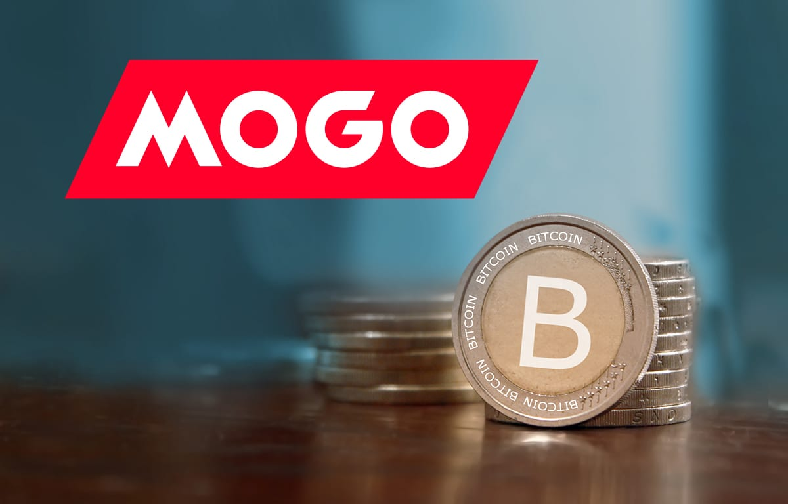

# Blockchain-homework

# Case Study Proposal: Mogo 

# What Is It

Mogo Inc. is a Vancouver-based fintech, founded in 2003 by David Marshall Feller. It offers users a free MogoAccount and provides access to various products through its finance app, including personal loans, identity fraud protection, digital mortgages, a Visa Prepaid Card, and credit score monitoring through Equifax.

Mogo also operates Bitcoin wallet. The MogoCrypto account, a product within MogoWealth that enables the buying and selling of bitcoin, and access to smart consumer credit products through. The company's platform delivers digital experience with various products all through one account.
# Why This Matters

Financial health is a top-of-mind issue for more and more Canadians, and we are seeing this reflected in the growing adoption of our unique multi-product financial health solution. The company is getting more attention as it’s member growth accelerated in 2020, due to the demand of it’s specific products – including Bitcoin, as well as, the value of having them all integrated into one seamless, easy to use, digital account that helps members manage their financial lives. According to David Feller, Mogo’s Founder and CEO “We believe we are well positioned for continued strong member growth and engagement in 2021.”

Also, Mogo strong believes that we are in the early stages of the transition from traditional banking to fintechs that offer new and innovative products, though. The company believes the leaders will be those that can manage this transition offering all products into one app helping people to manage their financial health. As one of the fintech pioneers in Canada, it’s well positioned to capitalize on these trends.
# Why This May be Interesting

Mogo focus its platform, objective-built to deliver the best in the market digital experience. Today the company has more than one million members and a marketing partnership with Canada's largest news media company, Mogo’s mission is to execute on its vision to gamify financial health and become the go-to financial app for the next generation of Canadians.

# Why it is spe

* Mogo innovative marketing collaborative agreement with Postmedia, Canadian news media company, until 2023.

* Canadians increasingly adoption on digital financial solutions to improve their financial health.

* Mogo bitcoin cashback and rewards, offering Canadians a simple and low cost way to buy and sell bitcoin.

# Resources

[Overview](https://investors.mogo.ca/)

[Press Release January/2021](https://investors.mogo.ca/press-releases/mogo-now-helping-over-1-1-million-canadians-improve-their-financial-health) 

[Marketing Agreement with Postmedia](https://investors.mogo.ca/press-releases/mogo-extends-innovative-marketing-agreement-with-postmedia-to-2023)

[Mogo-Crypto](https://www.mogo.ca/mogo-crypto) 

---

*[Referral](https://app.mogo.ca/e/ACdAEoIC19?referral_code=DHKBYEWK)*

