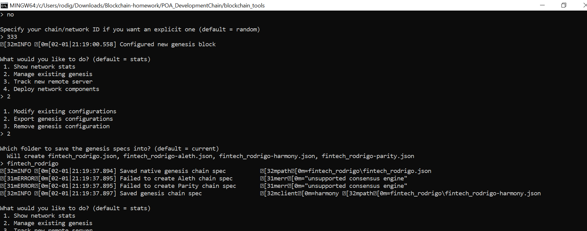
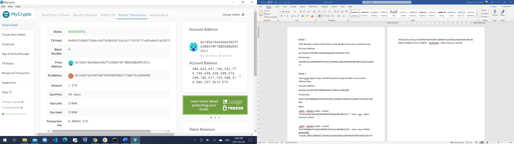

# Proof of Authority Development Chain

The PoA algorithm is typically used for private blockchain networks as it requires pre-approval of the account addresses that can approve transactions (seal blocks).

Before we start, you need to download Geth tool. It's the platform that allows you to run Ethereum Blockchain.

Be sure to get the correct version ***Geth % Tools 1.9.25 (64-bit)***

[Download Geth](https://geth.ethereum.org/downloads/)

Because the accounts must be approved, we first need to generate two new nodes with new account addresses that will serve as our pre-approved sealer addresses.

Create accounts for two nodes for the network with a separate datadir for each using geth, as bellow:

* 1. ./geth account new --datadir node1
Passworkd: 333

* 2. ./geth account new --datadir node2
Passworkd: 333

Next, generate your genesis block, to do it follow the steps:

* Run puppeth using the command -> **./puppeth**

* Name your network

* Select the option 2 -> **Configure a new genesis**

* Select the option 1 -> **Create new genesis from scratch**

* Select the option 2 -> **Clique - Proof of Authority**

* Paste both account addresses that we creates in the first astep, one at a time into the list of accounts to seal.

* Paste them again in the list of accounts to pre-fund. There are no block rewards in PoA, so you'll need to pre-fund.

* Choose **NO** for pre-funding the pre-compiled accounts (0x1 .. 0xff). This keeps the genesis cleaner.

* Specify your network ID -> **333**

* When you are back at the main menu, Select the option 2 -> **Manage existing genesis**.

* Select the option 2 -> **Export genesis configurations**. This will fail to create two of the files, but you only need networkname.json.

With the genesis block creation completed, we will now initialize the nodes with the genesis' json file.

Next, using geth, initialize each node with the new networkname.json.

*./geth --datadir node1 init 'networkname'.json*

*./geth --datadir node2 init 'networkname'.json*

Now the nodes can be used to begin mining blocks.

you need to run the nodes in ***separate terminal*** windows with the commands:

*./geth --datadir node1 --unlock "SEALER_ONE_ADDRESS" --mine --rpc --allow-insecure-unlock*

*./geth --datadir node2 --unlock "SEALER_TWO_ADDRESS" --mine --port 30304 --bootnodes "enode://SEALER_ONE_ENODE_ADDRESS@127.0.0.1:30303" --ipcdisable --allow-insecure-unlock*

NOTE: Type your password and hit enter - even if you can't see it visually!

Your private PoA blockchain should now be running!

With both nodes up and running, the blockchain can be added to MyCrypto for testing.

Open the MyCrypto app, then click Change Network at the bottom left:

Click **"Add Custom Node"**, then add the custom network information that you set in the genesis.

Make sure that you scroll down to choose Custom in the "Network" column to reveal more options like Chain ID:

Type **ETH** in the Currency box.

In the Chain ID box, type the **chain id** you generated during genesis creation.

In the URL box type: http://127.0.0.1:8545.  This points to the default RPC port on your local machine.

Finally, click **Save & Use Custom Node**.

After connecting to the custom network in MyCrypto, it can be tested by sending money between accounts.

Select the View & Send option from the left menu pane, then click Keystore file.

On the next screen, click Select Wallet File, then navigate to the keystore directory inside your Node1 directory, select the file located there, provide your password when prompted and then click Unlock.

This will open your account wallet inside MyCrypto.

This is the balance that was pre-funded for this account in the genesis configuration, however, these millions of ETH tokens are just for testing purposes.

In the To Address box, type the account address from Node2, then fill in an arbitrary amount of ETH:

Confirm the transaction by clicking "Send Transaction", and the "Send" button in the pop-up window.

Click the Check TX Status when the green message pops up, confirm the logout

You should see the transaction go from Pending to Successful in around the same blocktime you set in the genesis.

You can click the Check TX Status button to update the status.

Congratulations, you successfully created your own private blockchain!